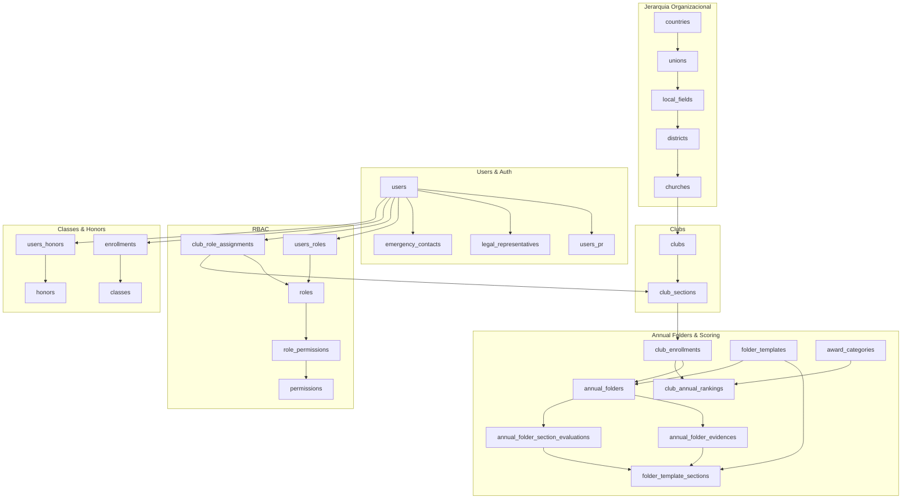

Referencia completa del schema de base de datos PostgreSQL de SACDIA. Sincronizado contra `schema.prisma` 2026-03-25. Cobertura: 83 modelos + 8 enums documentados.

## Diagrama ER Principal

---

## Modulos

| Modulo | Tablas | Pagina |
|---|---|---|
| Users & Auth | users, sessions, accounts, verifications, users_pr, legal_representatives, emergency_contacts | [Ver](/dev/base-de-datos/schema-reference/users-auth) |
| Jerarquia Organizacional | countries, unions, local_fields, districts, churches | [Ver](/dev/base-de-datos/schema-reference/organizacion) |
| Clubs | clubs, club_sections, club_role_assignments, club_types, ecclesiastical_years, units, club_ideals | [Ver](/dev/base-de-datos/schema-reference/clubs) |
| RBAC | roles, permissions, role_permissions, users_roles, users_permissions, relationship_types | [Ver](/dev/base-de-datos/schema-reference/rbac) |
| Clases y Honores | classes, honors, enrollments, users_honors, honor_requirements, class_modules, class_sections | [Ver](/dev/base-de-datos/schema-reference/clases-honores) |
| Salud e Insurance | diseases, allergies, medicines, pivotes, member_insurances | [Ver](/dev/base-de-datos/schema-reference/salud-insurance) |
| Inventario y Finanzas | inventory_categories, club_inventory, finances_categories, finances | [Ver](/dev/base-de-datos/schema-reference/inventario-finanzas) |
| Actividades y Camporees | activity_types, activities, activity_instances, camporees, inscripciones | [Ver](/dev/base-de-datos/schema-reference/actividades-camporees) |
| Investidura y Certificaciones | investiture_*, certifications, users_certifications | [Ver](/dev/base-de-datos/schema-reference/investidura-certificaciones) |
| Carpetas y Evaluacion | folders, folder_templates, annual_folders, evidences, rankings | [Ver](/dev/base-de-datos/schema-reference/carpetas-evaluacion) |
| Sistema y Recursos | notifications, fcm_tokens, weekly_records, resources, enums | [Ver](/dev/base-de-datos/schema-reference/sistema-recursos) |

---

## Convenciones de Naming

### Estandares Aplicados

**Tablas**:
- Plural: `users`, `clubs`, `classes`, `permissions`
- Snake case: `emergency_contacts`, `club_role_assignments`
- Descriptivo: `legal_representatives` (no `legal_reps`)

**Campos**:
- Snake case: `paternal_last_name`, `created_at`
- Descriptivo: `paternal_last_name` (no `p_lastname`)
- IDs explícitos: `user_id`, `club_type_id` (no `uid`, `ct_id`)

**IDs**:
- Tablas principales: `{tabla}_id` UUID
- Tablas pivote: `id` UUID como PK, FKs descriptivos
- Secciones de club: INT (`club_section_id`)

### Inconsistencias Detectadas (Pendientes)

| Tabla/Campo | Actual | Debería ser | Prioridad |
|---|---|---|---|
| `ecclesiastical_year` | Singular | `ecclesiastical_years` | ALTA |
| `club_types.ct_id` | Abreviado | `club_type_id` | ALTA |
| `inventory_categories.inventory_categoty_id` | Typo | `inventory_category_id` | ALTA |

---

## Ver Tambien

- [schema.prisma](https://github.com/abn-r/sacdia-backend/blob/main/prisma/schema.prisma) — Schema Prisma definitivo (fuente de verdad)
- [Migraciones](/dev/base-de-datos/migraciones) — Scripts SQL de migracion
- [API Reference](/dev/api) — Como la API consume estos modelos
