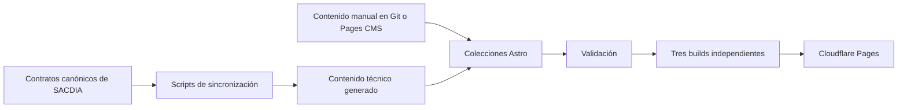

# Separar la documentación de SACDIA en tres portales Astro

SACDIA reemplazará el sitio actual basado en Fumadocs y Next.js por tres portales estáticos Astro + Starlight. Cada portal responderá a una audiencia concreta, tendrá navegación y búsqueda propias, y compartirá una identidad visual personalizada de SACDIA.

## Decisión

| Área | Decisión |
|---|---|
| Repositorio | Mantener la implementación en el repositorio independiente `sacdia-docs` |
| Organización | Monorepo pnpm con tres aplicaciones y paquetes compartidos |
| Motor | Astro + Starlight, con componentes visuales reemplazados por un shell propio |
| Contenido | Markdown/MDX validado mediante colecciones de contenido |
| Edición | Git para el equipo técnico y Pages CMS como editor visual |
| Hosting | Tres proyectos estáticos independientes en Cloudflare Pages |
| Seguridad | Portal operativo público; portales administrativo y técnico protegidos por Cloudflare Access |
| Identidad inicial | Listas de correos autorizados y códigos OTP administrados manualmente |

## Objetivos

- Ofrecer documentación orientada a las tareas reales de cada audiencia.
- Evitar que información administrativa o técnica quede expuesta públicamente.
- Mantener tres despliegues independientes sin duplicar diseño, configuración ni utilidades.
- Permitir que el equipo técnico trabaje desde Git y que autores administrativos usen un editor visual.
- Conservar la generación automática de referencias técnicas desde los contratos de SACDIA.
- Producir una experiencia visual propia; Starlight será el motor, no la apariencia final.

## Fuera de alcance inicial

- Integrar el login o el RBAC de SACDIA dentro de Astro.
- Añadir botones de ayuda contextual en `sacdia-app` o `sacdia-admin`.
- Filtrar páginas dinámicamente según cargos de club.
- Ofrecer búsqueda unificada entre los tres portales.
- Automatizar inmediatamente las altas y bajas entre Better Auth y Cloudflare Access.

## Audiencias y portales

### Portal operativo

**Audiencia:** personas que utilizan la aplicación móvil y consultantes públicos.

**Acceso:** público, sin autenticación.

**Contenido:**

- manuales por pantalla de la aplicación;
- tareas frecuentes y recorridos guiados;
- procesos que comienzan o terminan en la aplicación;
- preguntas frecuentes y resolución de problemas no sensibles.

### Portal administrativo

**Audiencia:** cualquier persona habilitada para entrar al panel administrativo.

**Acceso:** privado mediante Cloudflare Access y lista de correos autorizados.

**Contenido:**

- manuales por pantalla del panel;
- operación de clubes, finanzas, materiales, investiduras y demás módulos;
- procesos administrativos completos;
- cruces con pasos ejecutados previamente desde la aplicación.

### Portal técnico

**Audiencia:** equipo de desarrollo, representado inicialmente por `admin` y `super_admin`.

**Acceso:** privado mediante una lista de correos más restrictiva.

**Contenido:**

- endpoints y contratos de API;
- arquitectura y decisiones técnicas;
- tecnologías, configuración y convenciones;
- esquema de datos y referencias generadas;
- guías de integración, seguridad y desarrollo.

## Arquitectura del repositorio

```text
sacdia-docs/
├── apps/
│   ├── operativo/
│   │   ├── src/content/docs/
│   │   └── astro.config.mjs
│   ├── administrativo/
│   │   ├── src/content/docs/
│   │   └── astro.config.mjs
│   └── tecnico/
│       ├── src/content/docs/
│       └── astro.config.mjs
├── packages/
│   ├── ui/
│   ├── config/
│   └── content/
├── scripts/
├── docs/plans/
├── .pages.yml
├── package.json
└── pnpm-workspace.yaml
```

### Responsabilidades compartidas

`packages/ui` contendrá el shell visual, tokens, logotipo, cabecera, pie, tarjetas y componentes MDX. Ninguna aplicación copiará estos componentes.

`packages/config` centralizará TypeScript, lint, metadatos comunes y configuración base de Starlight.

`packages/content` definirá esquemas editoriales, componentes de contenido y utilidades para validar metadatos.

Cada aplicación será propietaria de su contenido, navegación, búsqueda, dominio y política de despliegue.

## Modelo de contenido

La unidad editorial no será solamente el módulo técnico. El portal distinguirá dos documentos principales.

### Manual de pantalla

Cada pantalla relevante de la aplicación o el panel tendrá un manual con:

1. propósito y resultado esperado;
2. audiencia y requisitos previos;
3. acciones disponibles;
4. recorrido principal;
5. estados vacíos, validaciones y errores comunes;
6. siguiente paso o proceso relacionado.

### Guía de proceso

Una guía de proceso describirá un flujo de principio a fin, incluso cuando cruce la aplicación y el panel. En lugar de duplicar instrucciones, enlazará o compondrá pasos reutilizables de los manuales de pantalla.

### Metadatos mínimos

```yaml
title: Registrar un pago
description: Completa y verifica el registro de un pago del club.
surface: admin
documentType: screen
module: finances
status: published
owners:
  - operations
lastReviewedAt: 2026-08-20
```

Los esquemas deben rechazar documentos sin título, descripción, superficie, tipo, módulo, responsables o fecha de revisión.

## Experiencia visual

Starlight proporcionará enrutamiento documental, accesibilidad base, tabla de contenidos, navegación y Pagefind. La interfaz no conservará el aspecto predeterminado de Starlight.

Se reemplazarán los componentes necesarios para obtener:

- portada orientada a tareas, no a estructura técnica;
- identidad visual consistente con SACDIA;
- navegación por módulos y procesos;
- buscador visible y específico de cada audiencia;
- páginas legibles, con jerarquía clara y bloques de acción;
- selector explícito entre Operativo, Administrativo y Técnico.

## Flujo editorial

### Equipo técnico

1. Edita Markdown/MDX o artefactos generadores desde Git.
2. Abre un cambio revisable.
3. Las validaciones comprueban esquema, enlaces y calidad.
4. Al integrarse el cambio, Cloudflare Pages reconstruye únicamente los sitios afectados.

### Autores administrativos

1. Abren Pages CMS.
2. Editan colecciones declaradas en `.pages.yml`.
3. Pages CMS escribe los archivos en GitHub.
4. El mismo flujo de validación y despliegue procesa el cambio.

Pages CMS no será una segunda fuente de verdad: Git seguirá almacenando el contenido. En la primera versión, el editor visual se limitará a autores documentales de confianza; no se habilitará para cualquier usuario del panel.

## Generación técnica

Los scripts existentes de endpoints, esquema y versiones se conservarán conceptualmente, pero escribirán únicamente dentro del portal técnico.



Los documentos generados incluirán una advertencia visible y no deberán editarse manualmente.

## Seguridad y despliegue

Cada aplicación tendrá un proyecto y dominio independiente. Los nombres definitivos de dominio se decidirán durante la configuración del hosting.

| Portal | Cloudflare Access | Indexación |
|---|---|---|
| Operativo | No | Permitida |
| Administrativo | Sí | Bloqueada |
| Técnico | Sí | Bloqueada |

Para los portales privados se protegerán tanto el dominio personalizado como el dominio `pages.dev` y los previews. También se aplicará `noindex` como defensa adicional, pero nunca como sustituto de Access.

Cloudflare Access utilizará OTP y listas de correos distintas. Como Cloudflare no conoce los `authorization.grants` de Better Auth, las altas y bajas se sincronizarán manualmente durante el MVP.

## Manejo de errores

- Un documento con metadatos inválidos debe detener la validación antes del despliegue.
- Un enlace interno roto debe bloquear la integración del cambio.
- Un visitante sin autorización no debe recibir HTML, recursos ni índices de búsqueda privados.
- Un fallo de sincronización automática no debe borrar el último contenido técnico válido.
- Las rutas inexistentes tendrán una página 404 útil, con búsqueda y navegación hacia el portal correspondiente.
- Los contenidos antiguos migrados conservarán redirecciones cuando exista una equivalencia clara.

## Validación

La implementación incluirá:

- validación de TypeScript y colecciones con `astro check`;
- pruebas unitarias para helpers y transformaciones de contenido;
- comprobación automática de enlaces internos;
- pruebas de humo por portal para navegación, búsqueda y páginas críticas;
- auditoría de accesibilidad de los componentes compartidos;
- verificación desplegada de las políticas de Cloudflare Access;
- comprobación de que los dominios y previews privados no sean indexables ni accesibles sin sesión.

Los builds se documentarán como comandos de validación, pero no se ejecutarán durante esta tarea salvo autorización explícita del usuario.

## Estrategia de migración

1. Crear el workspace y los tres esqueletos Astro/Starlight.
2. Construir el paquete visual compartido y una portada mínima por audiencia.
3. Migrar primero contenido público y operativo válido.
4. Migrar contenido administrativo desde los manuales funcionales existentes.
5. Mover referencias API, esquema y arquitectura al portal técnico.
6. Adaptar los scripts de sincronización y workflows.
7. Configurar Pages CMS después de estabilizar los esquemas de contenido.
8. Configurar los tres despliegues y proteger los dos privados.
9. Retirar Fumadocs solamente cuando el inventario y las redirecciones estén verificados.

## Riesgos y mitigaciones

| Riesgo | Mitigación |
|---|---|
| Duplicación entre manuales y procesos | Reutilizar pasos y enlazar documentos canónicos |
| Exposición por un dominio alternativo | Proteger dominio personalizado, `pages.dev` y previews |
| Altas y bajas desactualizadas | Checklist operativo y revisión periódica de listas |
| Divergencia visual entre sitios | Componentes y tokens exclusivamente compartidos |
| Contenido obsoleto | Responsables y fecha obligatoria de última revisión |
| Migración incompleta | Inventario de las 98 páginas actuales y matriz de cobertura de pantallas |
| Editor visual con acceso excesivo | Restringir autores; separar repositorios si posteriormente se exige aislamiento editorial fuerte |

## Criterios de aceptación

- Existen tres aplicaciones Astro/Starlight ejecutables de forma independiente.
- Las tres comparten una identidad visual propia de SACDIA.
- Cada portal tiene contenido, navegación y búsqueda aislados.
- El portal operativo no requiere autenticación.
- Los portales administrativo y técnico no entregan contenido sin Cloudflare Access.
- Los scripts técnicos escriben únicamente en el portal técnico.
- Git y el editor visual modifican la misma fuente Markdown/MDX.
- Existe una matriz de migración para las páginas actuales y las pantallas runtime.
- Fumadocs no se elimina antes de validar contenido y redirecciones.

## Siguiente paso

Crear el plan de implementación por incrementos pequeños y revisables, comenzando por el workspace y una prueba vertical de los tres portales antes de migrar el contenido completo.
